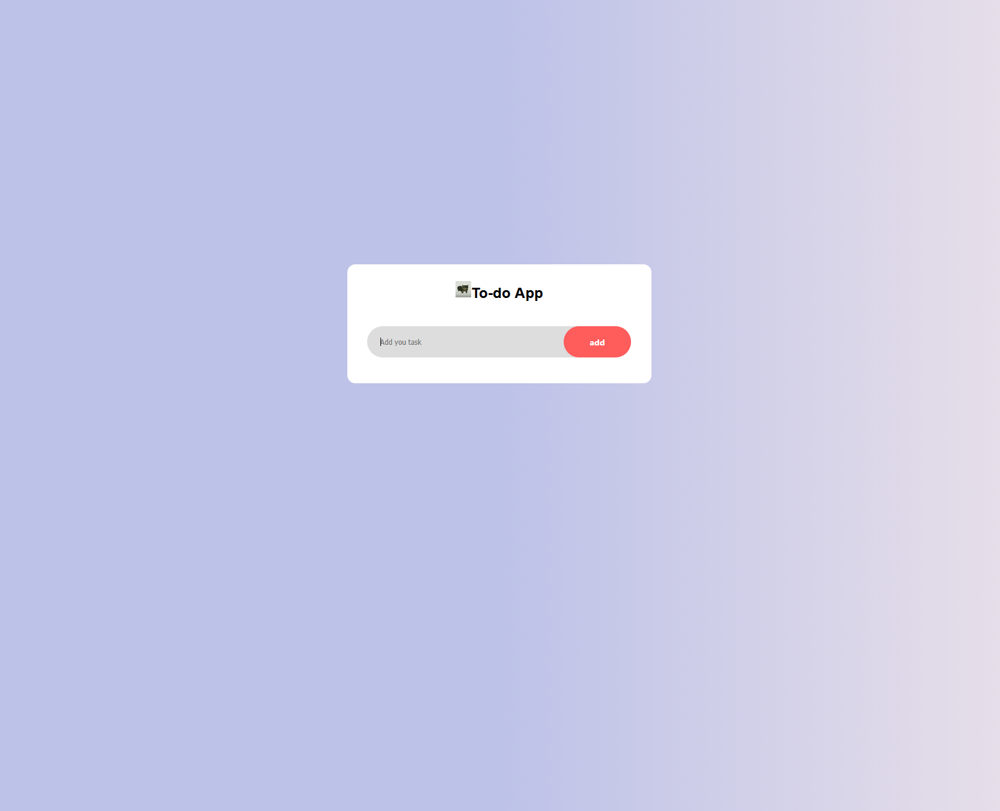
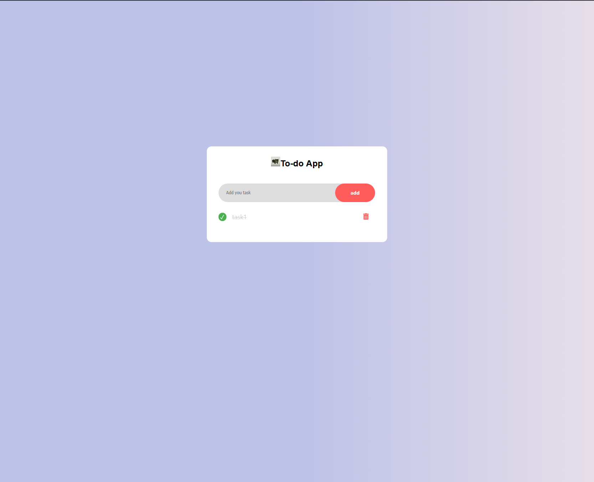
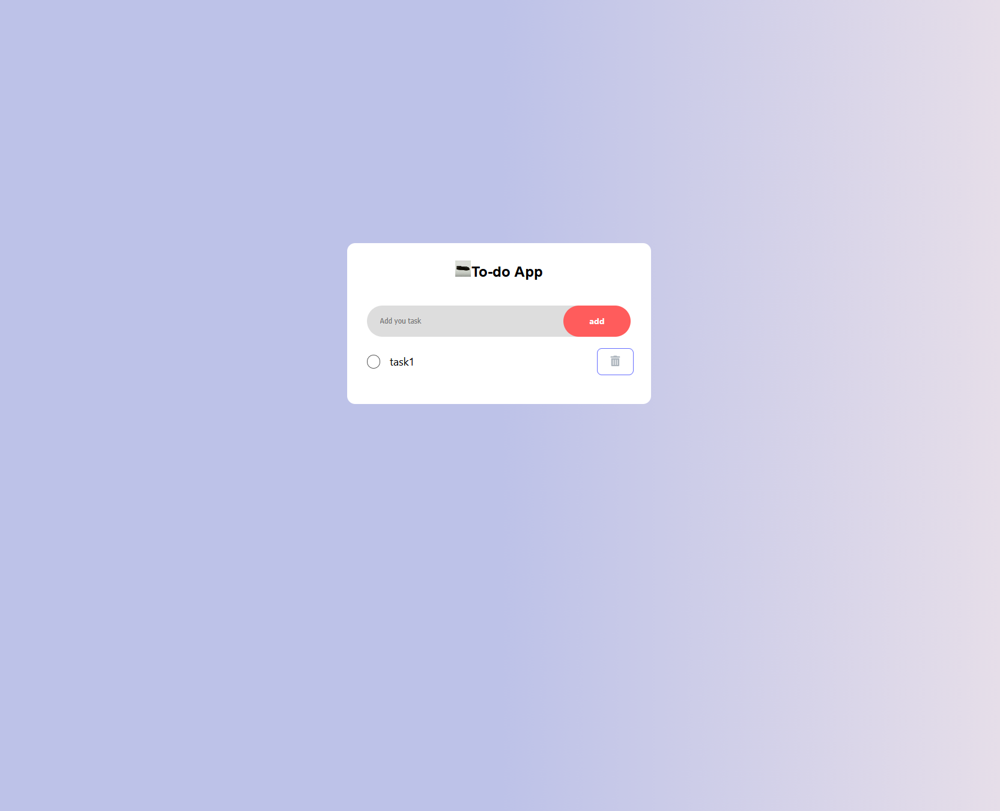

# Simple React Todo App

## React Todo App 

#### Simple app to-do-list,created on React using TypeScript. The app allows you to add tasks, mark them as completed, and delete them.

## Features

### 1. **Add task:** input with button add

### 2. **Check box:** opportunity to mark tasks as completed

### 3. **Delete:** opportunity to delete task which are completed, or task which is not completed

### 4. **Additional:** the app looks good on both large screens and mobile devices.

## Tech Stack

### 1. **React:** (Functional Components, Hooks: useState)

### 2. **TypeScript**

### 3. **SCSS:** (BEM-method)

### 4. **React Icons:** (react-icons)

### 5. **Vite**

## How to install

### 1. **Clone repo:** https://github.com/Iliapp/Reakt-project.git

### 2. **Install dependencies:** npm install react-icons (later and other)

### 3. **Start project:** npm run dev
