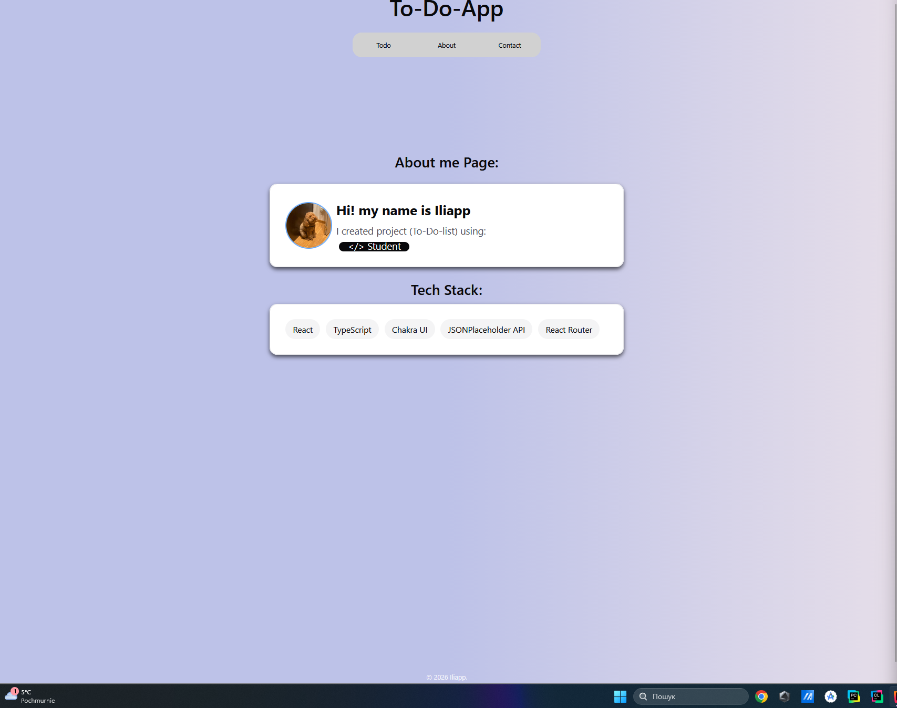
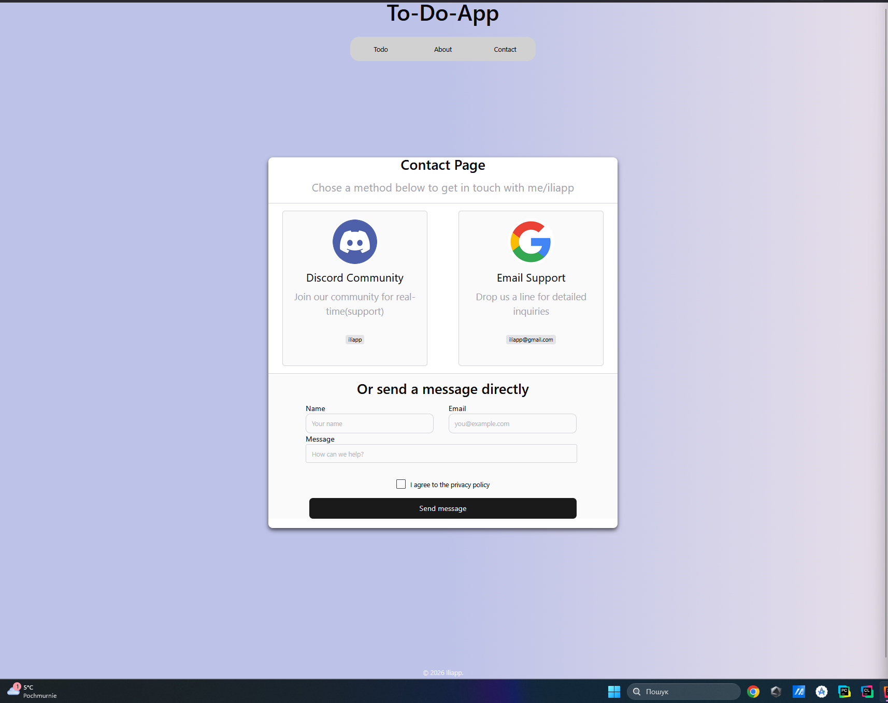

# Simple React Todo App

## React Todo App 

#### Simple app to-do-list,created on React using TypeScript. The app allows you to add tasks, mark them as completed, and delete them.

## Core Features

### 1. **Add task:** input with button add

### 2. **Check box:** opportunity to mark tasks as completed

### 3. **Delete:** opportunity to delete task which are completed, or task which is not completed

### 4. **Additional:** the app looks good on both large screens and mobile devices.

## About Page

### 1. **About me Page:** This page show information about me.

### 2. **About me Page(include Tech Stack):** which shows what i used to build this project

## Contact Page

### 1. **Contact Page:**.This page show information how to contact with me

## Tech Stack

### 1. **React:** (Functional Components, Hooks: useState)

### 2. **TypeScript**

### 3. **Chakra UI** 

### 4. **Axios:** 

### 5. **Zustand**

### 6.  **React Router**

### 7.  **Framer Motion**

### 8. **Vite** 

### 9. **ESLint + Prettier + Husky + lint-staged**

## How to install

### 1. **Clone repo:** https://github.com/Iliapp/Reakt-project.git

### 2. **Install dependencies:** npm install react-icons (later and other)

### 3. **Start project:** npm run dev

